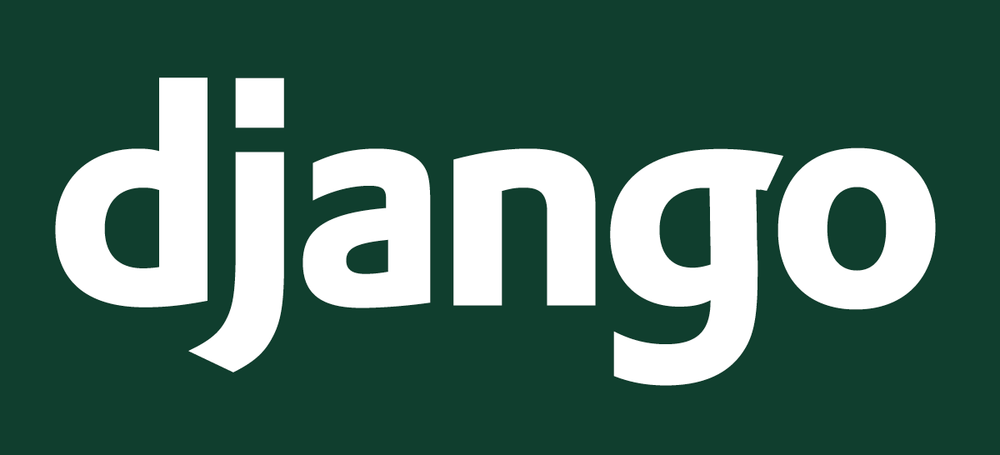

# Back End Squad Roadmap

<p style="display: flex; align-items: center; justify-content: space-arround; flex-wrap: wrap">
  <a href="https://laravel.com/"></a>
  <a href="https://www.djangoproject.com/"></a>
  <a href="https://dotnet.microsoft.com/en-us/download/dotnet-framework"></a>
</p>

## General Keys :
🔗 [Laravel - PHP](#-laravel---php)

🔗 [Django - Python](#-django---python)

🔗 [ASP.Net  Core - C#](#-aspnet---c)

## Roadmap Keys:

🔗 [Preparation](#preparation)

🔗 [Entry & Basics ](#entry--basics)

🔗 [Beginner](#beginner)

# General Topics:
## Preparation:

<details>
 <summary>CS Introduction </summary>


[Data Structures](https://www.youtube.com/watch?v=owCqVRbZlbg&list=PLCInYL3l2AajqOUW_2SwjWeMwf4vL4RSp)

#### OR

[Data Structures Easy to Advanced Course](https://www.youtube.com/watch?v=owCqVRbZlbg&list=PLCInYL3l2AajqOUW_2SwjWeMwf4vL4RSp)
________________________________________________________


[Programiz Website](https://www.programiz.com/dsa/data-structure-types)

[ Introductions to Algorithms](https://www.youtube.com/watch?v=8hly31xKli0&t=2s)


#### Recommended Books
[Grokking Algorithms](https://bit.ly/3xl71jO)
</details>


## Entry & Basics:


<details>
 <summary>How the Internet Works</summary>

[Backend Preparation Video: Client Server Model | Dynamic Sites | MVC | HTTP Protocol](https://www.youtube.com/watch?v=ToHfYbxg3ms&list=PLIzoD6CTXb3_iILDz7NIGj49stmeoDWh0&index=3)

🛜 [How the Internet Works](https://www.youtube.com/watch?v=7_LPdttKXPc)

#### OR

🛜 [How does the internet work? (Full Course)](https://www.youtube.com/watch?v=zN8YNNHcaZc)
#### OR
[كيف يعمل الإنترنت؟](https://www.youtube.com/watch?v=TnMNDQHB33Q)
</details>


<details>
 <summary>What is HTTP?</summary>

🛜 [HTTP Crash Course & Exploration](https://www.youtube.com/watch?v=iYM2zFP3Zn0)
#### OR
🧾 [Everything you need to know about HTTP](https://cs.fyi/guide/http-in-depth)
</details>

<details>
 <summary>What is API?</summary>

🛜 [What is an API?](https://www.youtube.com/watch?v=s7wmiS2mSXY)

[ما هو الـ API و ما فائدته في البرمجة؟ و كيف يعمل؟](https://www.youtube.com/watch?v=rq7DvjN1Gco)
</details>

<details>
 <summary>How does a browser work ?</summary>

🛜 [How does a browser work ? | Engineering side](https://www.youtube.com/watch?v=5rLFYtXHo9s)

</details>


<details>
 <summary>ملخص ايه اللى بيحصل من وراك لما بتفتح موقع انترنت</summary>

🛜 [OSI Layers](https://www.youtube.com/watch?v=A31bxOyj5mk&t=10s)
### NOTE:
#### You Need To Search For New Terms After This Video.
</details> 

<details>
 <summary>Command Line</summary>

🛜 [ كورس أساسيات Command Line ](https://www.youtube.com/watch?v=wmZMMcm7zWA)

#### OR

[[Arabic] Learn Command Line #01 - Intro and What's Shell, Terminal, CMD](https://www.youtube.com/watch?v=JVs2Ywy7wGQ&list=PLDoPjvoNmBAxzNO8ixW83Sf8FnLy_MkUT)

</details>

## Beginner:

<details>
 <summary>Some Front Basics</summary>

📽️ [HTML - Arabic 1 - 32](https://www.youtube.com/playlist?list=PLDoPjvoNmBAw_t_XWUFbBX-c9MafPk9ji)

📽️ [HTML & CSS - Crash  Course Arabic](https://www.youtube.com/watch?v=aHzw_8wWl48)

📽️ [JS  - Crash Course](https://www.youtube.com/watch?v=W6NZfCO5SIk)

📽️ [AJAX  - Crash Course](https://www.youtube.com/watch?v=82hnvUYY6QA)

📽️ [JSON  - Crash Course](https://www.youtube.com/watch?v=wI1CWzNtE-M)


</details>

<details>
 <summary>Introduction To Database</summary>

📽️ [Database Design Course](https://www.youtube.com/watch?v=ztHopE5Wnpc)

📽️ [MySQL Tutorial for Beginners](https://www.youtube.com/watch?v=7S_tz1z_5bA)

📽️ [SQL Tutorial - Full Database Course for Beginners](https://www.youtube.com/watch?v=HXV3zeQKqGY)

#### OR
📽️ [Database Fundamentals](https://maharatech.gov.eg/course/view.php?id=740) ***DB Design***

📽️ [مقرر أساسيات قواعد البيانات - DB 1](https://www.youtube.com/playlist?list=PL37D52B7714788190)

📽️ [المقرر العملى](https://www.youtube.com/playlist?list=PL85D9FC9DFD6B9484)
</details>

<details>
 <summary>UML & Modeling - Requirements Analysis </summary>

***You Need To Search More In This Section***

📽️ [UML Diagrams Full Course](https://www.youtube.com/watch?v=WnMQ8HlmeXc)

🌐 [Visual Paradigm - Website](https://www.visual-paradigm.com/guide/uml-unified-modeling-language/what-is-uml/)

> Keep Deep
>
📖 [UML Distilled 3rd Ed](https://github.com/gcoronelc/PECI-Java-MAR-2015/blob/master/Recursos/UML%20Distilled%203rd%20Ed.pdf)

</details>

<details>
 <summary>Version Control - Git & Github</summary>

📽️ [Git & GitHub - Arabic, Almdrasa](https://almdrasa.com/tracks/programming-foundations/courses/git-github/)

#### OR
🌐 [Version Source Control | التحكم بالاصدارت](https://www.youtube.com/watch?v=Jaqrcw_MB9E&list=PL4n1Qos4Tb6R4guGC4oX_PZVt8E8XpvqE)

> Keep Deep
>
📖 [UML Distilled 3rd Ed](https://github.com/gcoronelc/PECI-Java-MAR-2015/blob/master/Recursos/UML%20Distilled%203rd%20Ed.pdf)

</details>

> [!IMPORTANT]
> From Here Feel Free To Choose Any Path You Want To Start With. ***OFC. After You Finish The Basics & Search About Different Paths***

# # Laravel - PHP:
<details>

 <summary>PHP Basics</summary>

  <summary> Master your editor</summary>

📹 [Phpstorm](https://laracasts.com/series/phpstorm-for-laravel-developers)


📽️ [Learn PHP 8 In Arabic](https://www.youtube.com/watch?v=xcg9qq6SZ0w&list=PLDoPjvoNmBAy41u35AqJUrI-H83DObUDq)

#### OR
📽️ [Full PHP 8 Tutorial - Until 33](https://www.youtube.com/watch?v=sVbEyFZKgqk&list=PLr3d3QYzkw2xabQRUpcZ_IBk9W50M9pe-) ** Recommended

#### OR
📽️ [PHP Programming Language Tutorial - Full Course](https://www.youtube.com/watch?v=OK_JCtrrv-c)

</details>


<details>
 <summary>PHP OOP</summary>

***You Need To Search After Watching Any Video***

📽️ [Learn Object Oriented PHP - Arabic](https://www.youtube.com/playlist?list=PLDoPjvoNmBAxXTPncg0W4lhVS32LO_xtQ)

#### OR
📽️ [OOP in Arabic - Omar Ahmed](https://www.youtube.com/watch?v=sVbEyFZKgqk&list=PLr3d3QYzkw2xabQRUpcZ_IBk9W50M9pe-) ***Java But Highly Recommended***

#### OR
📽️ [Object Oriented PHP Tutorials - English](https://www.youtube.com/playlist?list=PL0eyrZgxdwhypQiZnYXM7z7-OTkcMgGPh)

#### OR
📽️ [Object-Oriented Principles in PHP](https://laracasts.com/series/object-oriented-principles-in-php) ***Paid***

> You Can See it As A Refresh Your Knowledge As Crash Course

📽️ [Introduction to OOP](https://www.youtube.com/watch?v=gUNVnOIK7CM&list=PL71ekc7LvuXK5irXyxo2tRI8fm9QIm0Gj)

</details>

<details>
 <summary>PHP MVC</summary>

📽️ [MVC Explained - Arabic](https://www.youtube.com/watch?v=2Q69R0GD9zM)

#### OR
📽️ [MVC Explained - English](https://www.youtube.com/watch?v=DUg2SWWK18I)

#### AND
📽️ [PHP MVC Framework from scratch - English ](https://www.youtube.com/watch?v=q0JhJBYi4sw)

#### OR
📽️ [PHP MVC project in arabic](https://www.youtube.com/playlist?list=PL7mt2FDjAkPepYrMofOwTwxQwJSlZ8N-a)

#### OR
📽️ [PHP MVC - Arabic](https://www.youtube.com/watch?v=G9ZQNT9M3Hc&list=PLv-kDGQ3al9t6kNKTxxWMog_GES3-XLm1)

> After Watching The Previous You Need To Deep and Practise So Must See It
>
📽️ [PHP For Beginners Laracasts 2023-edition - English](https://laracasts.com/series/php-for-beginners-2023-edition)
</details>

<details>
 <summary>PHP Native Projects</summary>

📽️ [medical project using php and mysql and ajax - Arabic](https://www.youtube.com/watch?v=7SSAycLnrsM&list=PLe_UJpVeP8qDV8zpkvCyjOQQPKPkwZ-6p)

#### OR
📽️ [Complete Mobile Shopee E-Commerce Website Course - PHP & MySQL](https://www.youtube.com/watch?v=KLWA2vCERSQ)

#### AND
📽️ [Create a PHP Application | PHP MVC Project Tutorial](https://www.youtube.com/watch?v=Rkg731t47dc&t=1s&ab_channel=DaveGray)

</details>

<details>
 <summary>Laravel Basics</summary>

📽️ [Backend Bootcamp: Laravel & Backend Introducion - Eyad Hamza](https://www.youtube.com/playlist?list=PLIzoD6CTXb3_iILDz7NIGj49stmeoDWh0)

📽️ [Laravel 8 From Scratch - Jeffry Way](https://laracasts.com/series/laravel-8-from-scratch) ***Highly Recommended***

#### OR
📽️ [Laravel From Scratch ](https://www.youtube.com/watch?v=376vZ1wNYPA)

📽️ [Laravel 10 Beginners Course](https://youtube.com/playlist?list=PLqDySLfPKRn5d7WbN9R0yJA9IRgx-XBlU&si=ei_2kJF0FwaK03Ge)
</details>

<details>
 <summary>Laravel Projects</summary>

***First Watch To Know How To Apply***

📽️ [Laravel 6 From Scratch](https://laracasts.com/series/laravel-6-from-scratch)

📽️ [Laravel PHP Framework - Insta Clone](https://www.youtube.com/watch?v=ImtZ5yENzgE)

📽️ [Laravel From Scratch 2022 - Laragigs](https://www.youtube.com/watch?v=MYyJ4PuL4pY&list=LL&index=3)

***After That You Need To Apply Alone - Search About Templates***

🌐 [Like Those](https://bootstrapmade.com/bootstrap-resume-cv-templates/)
</details>

<details>
 <summary>Admin Panels</summary>

***Filament Is The Most Common Framework To Create Dashboard But You Free To Use Another***

📽️ [Laravel Filament](https://www.youtube.com/playlist?list=PL6tf8fRbavl3lxHRw44aKyW0Hq2IXmxGv)

📽️ [Laravel Filament Roles and Permissions](https://www.youtube.com/playlist?list=PL6tf8fRbavl2oguMj5NSrQXhsd6ztc8_O)

📽️ [Filament Daily Channel For Tips](https://www.youtube.com/@FilamentDaily)
</details>

<details>
 <summary>Laravel API</summary>

📽️ [Creating a Laravel API](https://www.youtube.com/watch?v=mgdMeXkviy8)

📽️ [Laravel 8 REST API With Sanctum Authentication](https://www.youtube.com/watch?v=MT-GJQIY3EU&t=2127s)

📽️ [Laravel API Crash Course For Beginners](https://www.youtube.com/watch?v=xvqPEEpRBJ4&list=LL&index=3&t=11s)

📽️ [Laravel MentorSHIP: Travel API](https://www.youtube.com/playlist?list=PLdXLsjL7A9k2utMAieXUnUP8zyxaDA3mP) ***Recommended After One Or Two Videos Watched***
</details>

> ***Here You Need To Search About API Documentation***
#### Intermediate:

<details>
  <summary>Read about Laravel best practices & Tips</summary>

📄 [Laravel Best Practices Repository](https://github.com/alexeymezenin/laravel-best-practices)

📄 [Laravel Tips Repository](https://github.com/LaravelDaily/laravel-tips)

</details>
<details>

  <summary>Laravel Advanced Concepts</summary>

📹 [Laravel Advanced - Coder's Tape](https://www.youtube.com/watch?v=_z9nzEUgro4&list=PLpzy7FIRqpGD5pN3-Y66YDtxJCYuGumFO)
</details>
<details>

  <summary>Laravel Testing</summary>

📹 [Laravel Testing - LaravelDaily](https://www.youtube.com/watch?v=BuDger5Ytbc&list=PLdXLsjL7A9k0esh2qNCtUMsGPLUWdLjHp)


📹 [Laravel Testing - Laracasts](https://laracasts.com/series/build-a-laravel-app-with-tdd)

OR

📹 [Laravel Testing](https://www.youtube.com/playlist?list=PLpzy7FIRqpGAbkfdxo1MwOS9xjG3O3z1y)

</details>
<details>

  <summary>Laravel package development</summary>

📹 [Laravel Package Development](https://www.youtube.com/playlist?list=PLpzy7FIRqpGBQ_aqz_hXDBch1aAA-lmgu)

</details>

<details>

  <summary>Useful laravel packages</summary>

📹 [Laravel packages](https://www.youtube.com/playlist?list=PLEhEHUEU3x5pcQJHE8WBLqlHt2o3q5O-f)


</details>

## Advanced General:
<details>

  <summary>More Data Structures and Algorithms</summary>

📹 [Data Structures and Algorithms - MIT](https://www.youtube.com/playlist?list=PLUl4u3cNGP63EdVPNLG3ToM6LaEUuStEY)
</details><details>

  <summary>Advanced Database Systems - CMU</summary>

📹 [Advanced Database Systems - CMU](https://www.youtube.com/watch?v=LWS8LEQAUVc&list=PLSE8ODhjZXjYzlLMbX3cR0sxWnRM7CLFn)
</details>
</details><details>

  <summary>NoSQL Database Tutorial</summary>

📹 [NoSQL Database Tutorial](https://www.youtube.com/watch?v=xh4gy1lbL2k)
</details>
<details>

  <summary>Operating Systems</summary>

📹 [Operating Systems - Berkeley](https://www.bilibili.com/video/BV1e7411B7Ja?p=3)

</details>
<details>

  <summary>Distributed Systems</summary>

📹 [Distributed Systems University of Cambridge - Martin Kleppmann](https://www.youtube.com/playlist?list=PLeKd45zvjcDFUEv_ohr_HdUFe97RItdiB)

📄 [Lecture Notes](https://www.cl.cam.ac.uk/teaching/2122/ConcDisSys/dist-sys-notes.pdf)


</details>
<details>

  <summary>Web Application Security</summary>

📖 [Web Application Security Book](https://www.oreilly.com/library/view/web-application-security/9781492053101/)

  </details>
<details>

<summary> Design Patterns & SOLID Principle </summary> 

##### Books

📖 [Head First Design Pattern 2nd Edition](https://drive.google.com/file/d/1BmXIGt6CaMig1qXiqETQI5y3wsmh4N1z/view?usp=sharing)

##### Videos

📹 [Mosh  Design Pattern](https://www.youtube.com/watch?v=NU_1StN5Tkk&ab_channel=ProgrammingwithMosh)

📹 [Arabic SOLID Principle](https://www.youtube.com/playlist?list=PLnqAlQ9hFYdflFSS4NigVB7aSoYPNwHTL)

📹 [Arabic Creational Design Pattern](https://www.youtube.com/watch?v=hT9Gv_wabbw&list=PLnqAlQ9hFYdewk9UKGBcHLulZNUBpNSKJ&ab_channel=MohammedReda)

📹 [Arabic Structural Design Pattern](https://www.youtube.com/watch?v=5qBVy3dCEQw&list=PLnqAlQ9hFYdcW3viz_oXRal_FNkg2Dssm&ab_channel=MohammedReda)

📹 [Arabic Design Pattern](https://www.youtube.com/watch?v=-UQND--CVew&list=PLd-dOEgzBpGnt3GuEszo_piQq52XSqAmj&ab_channel=DevGeeksAcademy)

📹 [Arabic PHP Design Pattern](https://www.youtube.com/watch?v=hYas1gMp2nM&list=PLdYYj2XLw5BnpInmR103TyVwFd_CLI6IS&ab_channel=RamyHakam)

📹 [Head First Design Pattern As an English Playlist](https://www.youtube.com/playlist?list=PLrhzvIcii6GNjpARdnO4ueTUAVR9eMBpc)
##### Website

🖇️ [Refactoring GURU Design Pattern](https://refactoring.guru/design-patterns)

##### Articles & Repos

📄 [SOLID Article - Digital Ocean](https://www.digitalocean.com/community/conceptual-articles/s-o-l-i-d-the-first-five-principles-of-object-oriented-design)

📄 [Design Patterns - Repo](https://github.com/kamranahmedse/design-patterns-for-humans)

</details>
<details>

<summary>Object-Oriented Analysis and Design</summary> 

📖 [Head First Object-Oriented Analysis and Design](https://github.com/MarkPThomas/HeadFirst-OOAD/blob/master/Head%20First%20Object-Oriented%20Analysis%20and%20Design.pdf)

</details>
<details>

<summary> Clean Code & Refactoring </summary> 

📖 [Clean Code](https://github.com/ontiyonke/book-1/blob/master/%5BPROGRAMMING%5D%5BClean%20Code%20by%20Robert%20C%20Martin%5D.pdf)

📖 [Refactoring To Patterns](https://github.com/abhinavkorpal/awesome-computer-science-EBook/blob/master/DesignPatterns/Refactoring%20To%20Patterns%20-%20Joshua%20Kerievsky.pdf)

📖 [Martin Fowler](https://martinfowler.com/books/)

</details>

### Integration and Deployment:

<details>

<summary> CI CD </summary> 

📹 [Continuous Integration And Continuous Delivery](https://www.youtube.com/watch?v=h9K1NnqwUvE&ab_channel=Simplilearn)


</details>

<details>

<summary>  Container </summary> 

📹 [Docker - Free Code Camp - English](https://www.youtube.com/watch?v=fqMOX6JJhGo&ab_channel=freeCodeCamp.org)

📹 [Docker - TechWorld with Nana - English](https://www.youtube.com/watch?v=3c-iBn73dDE&ab_channel=TechWorldwithNana)

📹 [Docker Practical Course - Arabic](https://www.youtube.com/watch?v=tHP5IWfqPKk&list=PLzNfs-3kBUJnY7Cy1XovLaAkgfjim05RR)

</details>

<details>

<summary>  Cloud </summary> 

📹 [AWS - Free Code Camp](https://www.youtube.com/watch?v=3hLmDS179YE&ab_channel=freeCodeCamp.org)

</details>

<details>

<summary>Deployment</summary> 
📹 [Deploy on digital oceans](https://www.youtube.com/watch?v=QnNA7YdvCYA&list=PLseEp7p6EwiZrR_9dzp8d3AVcBqPz-HFZ&index=3)

📹 [Deploy on shared hosting](https://www.youtube.com/watch?v=6g8G3YQtQt4)

  </details>

--------------------------------------------------------
# # Django - Python

- [Python Basics](https://youtube.com/playlist?list=PLDoPjvoNmBAyE_gei5d18qkfIe-Z8mocs&si=6dJUvnt3gyyANybO)

- [OOP](https://youtube.com/playlist?list=PLDoPjvoNmBAyE_gei5d18qkfIe-Z8mocs&si=6dJUvnt3gyyANybO)

- [Django Basics](https://youtube.com/playlist?list=PL2z1gXAKH9c3XUn2HYMWRbAon4z6AQ4CL&si=DFu4WEykODIyNbKA)

- [Django ORM](https://youtube.com/playlist?list=PLOLrQ9Pn6cazjoDEnwzcdWWf4SNS0QZml&si=NwYIqVaAh53uZi7Z)


<br>
<details>

<summary>Start To Create Django Projects</summary>

- [Protfolio resume project](https://youtu.be/pLN-OnXjOJg?si=VVUSW1foiNtkKs5t)

- [Todo Project](https://youtu.be/4RWFvXDUmjo?si=LeXdC-vWVGUx-RUM)

- [Voting App](https://youtu.be/dPoGRYz-n5E?si=2HBaKimeH0eIpO2v)

- [Todo App With Authentication](https://youtu.be/llbtoQTt4qw?si=mHJQsp7zgDDhXM7p)

- [Chat System](https://www.youtube.com/watch?v=cw8-KFVXpTE)


</details>


<br>

```
This incoming technologies is very important for you.
As you will use it for work in companies.
```

<br>

- [Django Rest Framework ](https://youtube.com/playlist?list=PLXqhO5lRtxJV6oWcW2vlPHRzRFF6gVvc3&si=OoxMHr4_NETs7Yre)


- [Postman](https://www.youtube.com/watch?v=NDKlI0DvolY)

- [CRUD](https://youtu.be/oj7DEXQdVqw?si=Eq34ZItKfxfu3qfR)

- [JWT Authentication](https://youtu.be/pUBAYMMpx3I?si=wl00ljNLiEiI6MzT)

- [Pagination](https://www.youtube.com/watch?v=ZgmF6AX3U7E)

- [Redis](https://www.youtube.com/watch?v=tJVNUYvjTUk)

- [Celery](https://youtube.com/playlist?list=PLLz6Bi1mIXhHKA1Szy2aj9Jbs6nw9fhNY&si=MlSTRVIFBtlH7FBm)

- [Docker - #1 -> #4](https://youtube.com/playlist?list=PLOLrQ9Pn6cazCfL7v4CdaykNoWMQymM_C&si=NMMhdArWo3EM9T_6)

--------------------------------------------------------

# # Asp.net - C# 

> [!TIP]
> This Roadmap Guides Aspiring C# Developers, From Beginners To Intermediates, On Their Learning Journey. It Outlines Essential Topics, Resources, And Best Practices To Navigate The .Net Ecosystem Effectively.


## Prerequisites

- Passion for coding
- Basic understanding of programming concepts

## Beginner Level

**C# Syntax and Fundamentals:**

- **[ITI C# Courses](https://www.youtube.com/playlist?list=PLsV97AQt78NT0H8J71qe7edwRpAirfqOI)** 
- **[Passionate Coders C# Tutorial](https://www.youtube.com/watch?v=yqUeKsXwfRE&list=PL5RGzfpIj4jEhPZGKf7cRTp_k4-PzcEmZ&index=3)** 

**Intermediate (OOP):** 
* **[Issam Abd Elnabi (OOP videos only)](https://youtube.com/playlist?list=PL4n1Qos4Tb6SWPbJNpiznp-Ok4A8J_23l)** (highly recommended)
* **[passionate coders](https://www.youtube.com/playlist?list=PLsV97AQt78NQumtM4rQc77yjbkZcGOTX5)** 


**Advanced C#**
* **[Passionate Coders](https://www.youtube.com/playlist?list=PLsV97AQt78NQYhO7NqlBTrJX_Nsk3SmyY)**
* **[Issam Abd Elnabi](https://youtube.com/playlist?list=PL4n1Qos4Tb6SWPbJNpiznp-Ok4A8J_23l)**
* **[TimCorey](https://www.youtube.com/playlist?list=PLLWMQd6PeGY12yNE714jffLFnMVZCwvvZ)**


**Highly Recommended Books**
* Illustrated C# 7
* C# in nutshell (reference)

**Databases:**

- **SQL Server (DBMS):**
    - **[Issam AbdelNabi SQL Server Course](https://www.youtube.com/playlist?list=PL4n1Qos4Tb6RP_OovpgjoHLkCVaYFy-aj)** 
    - **[الدسوقي SQL Server](https://www.youtube.com/channel/UCyXgP5-bU159_w7tK_4YbpQ)** 


- **Query Language in C# (LINQ):**
    - **[Issam's LINQ Resources](https://www.youtube.com/playlist?list=PL4n1Qos4Tb6Sj1Y4xJuJoWCuqleeG2yt6)** 
    - **[FreeCodeCamp LINQ Tutorials](https://www.youtube.com/watch?v=5l2qA3Pc83M&t=3849s)** 

- **EF Core (ORM)**
  - **[DevCreed](https://www.youtube.com/playlist?list=PL62tSREI9C-cHV28v-EqWinveTTAos8Pp)**
  - **[Issam Abd Elnabi](https://youtube.com/playlist?list=PL4n1Qos4Tb6QZkbTWJx7wHqEABP8Pg6uv)** 

**Solid Principles**

- **[Passionate Coders](https://www.youtube.com/playlist?list=PLsV97AQt78NRT1GmH2EJ-o-2_ILFM9feq)** 
- **[Issam's Solid Principles Course](https://www.youtube.com/playlist?list=PL4n1Qos4Tb6ThSyydEJTm7xJ3qEwE8Oyu)** 

**Design Patterns:**

- **[Pasionate Coders](https://www.youtube.com/playlist?list=PLsV97AQt78NRT1GmH2EJ-o-2_ILFM9feq)** (recommended)
- **[Issam's Design Patterns Resources](https://www.youtube.com/playlist?list=PLsV97AQt78NTrqUAZM562JbR3ljX19JFR)** 


**Web Development with ASP.NET Core:**

- **Essential courses:**
    - **[ASP.NET Core for Beginners](https://www.youtube.com/playlist?list=PLLWMQd6PeGY12yNE714jffLFnMVZCwvvZ)**
    - **[Dependency Injection and Life Cycles by Tim Corey](https://www.youtube.com/watch?v=Hhpq7oYcpGE)**
    - **[MVC Pattern Introduction](https://www.youtube.com/playlist?list=PLX1bW_GeBRhAjpkPCTpKXJoFGe2ZpYGUC)**
    - **[Practice with a small CRUD project.](https://www.youtube.com/playlist?list=PL62tSREI9C-c-Zw9Pafbd7VQTfZMtn8yQ)**

- **Web Api**
    - **[Web APIs with Devcreed Tutorials](https://www.youtube.com/playlist?list=PL62tSREI9C-c_yZ0a7Yui1U22Tv4mBjSF)**

- **[Repository Pattern](https://www.youtube.com/playlist?list=PL62tSREI9C-e6nQ47brLj00iSGddiee73)**


### Authentication & Security
* **[ASP.NET Core API with JWT Authentication](https://www.youtube.com/playlist?list=PL62tSREI9C-eYNE1Pyw0yv1tETs5V8WGd)** 
* **[JWT Refresh Tokens In .Net 6 (Core)](https://www.youtube.com/playlist?list=PL62tSREI9C-foV0zXVpW_f0JNtTD6Wv2W)**

* **Pro ASP.NET Core 6 (Chapters on Authentication & Authorization):** Deepen your understanding with recommended book chapters (refer to book for specific chapters).

### Caching & Unit Testing

* **[Memory Cache](https://www.youtube.com/playlist?list=PL62tSREI9C-foV0zXVpW_f0JNtTD6Wv2W)**
* **[Unit Testing](https://www.youtube.com/playlist?list=PL4n1Qos4Tb6RrQpmpGWALaE1PVvWR8d3A)** 

## Advance & Important Concepts

* **[Shiv Kumar's C# Playlist](https://www.youtube.com/playlist?list=PLJ0hAqAAdnpD5ohNkTH_TMnes0tDa6cua)** Explore advanced topics through extensive video tutorials. 

* **[tutorialsEU - C#](https://www.youtube.com/playlist?list=PLSr9CPTtmP9js0n4XOmI4vfKeVvlS32PA)** Find additional resources for specific topics as needed.


### Reference Books

* **Pro ASP.NET Core** Master practical web development techniques.
* **ASP.NET Core in Action** Gain comprehensive knowledge of the ASP.NET Core framework.
* **Building Web APIs with ASP.NET Core** 


